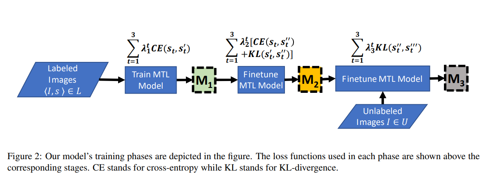

# Multitask Eye Disease Recognition
Multitask learning for eye disease recognition.  

Work done in Microsoft AI Research. Published in WACV'21. 

While accurate disease prediction from retinal fundus images is critical, collecting large amounts of high quality labeled training data to build such supervised models is difficult. Deep learning classifiers have led to high accuracy results across a wide variety of medical imaging problems, but they need large amounts of labeled data. Given a fundus image, we aim to evaluate various solutions for learning deep neural classifiers using small labeled data for three tasks related to eye disease prediction: (T1) predicting one of the five broad categories – diabetic retinopathy, age-related macular degeneration, glaucoma, melanoma and normal, (T2) predicting one of the 320 fine-grained disease sub-categories, (T3) generating a textual diagnosis. The problem is challenging because of small data size,
need for predictions across multiple tasks, handling image variations, and large number of hyper-parameter choices. Modeling the problem under a multi-task learning (MTL) setup, we investigate the contributions of each of the proposed tasks while dealing with a small amount of labeled data. Further, we suggest a novel MTL-based teacher ensemble method for knowledge distillation. On a dataset of 7212 labeled and 35854 unlabeled images across 3502 patients, our technique obtains ∼83% accuracy, ∼75% top-5 accuracy and ∼48 BLEU for tasks T1, T2 and T3 respectively. Even with 15% training data, our method outperforms baselines by 8.1, 3.2 and 11.2 points for the three tasks respectively.

Link to paper:- https://openaccess.thecvf.com/content/WACV2021/papers/Chelaramani_Multi-Task_Knowledge_Distillation_for_Eye_Disease_Prediction_WACV_2021_paper.pdf

<b>Architecture Diagram</b>



Run the code with:- 
```
python main.py
```

Configuration can be modified in 

```
config.gin
```


